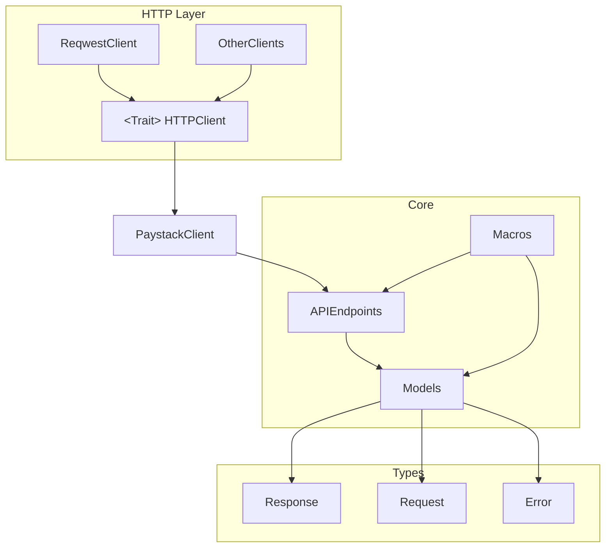

# paystack-rs

[](https://github.com/morukele/paystack-rs/actions/workflows/main.yml)
[](https://crates.io/crates/paystack-rs)
[](https://docs.rs/paystack-rs)
[](https://opensource.org/licenses/MIT)

Convenient Rust bindings and types for the [Paystack](https://paystack.com) HTTP API aiming to support the entire API surface. Not the case? Please open an issue. I update the definitions on a weekly basis.

The client aims to make receiving payments for African business or business with African clients building with Rust as hassle-free as possible.

**Note** : While the crate aims to support sync and async use cases, only async use case is supported at the moment.

The client currently covers the following section of the API, and the sections to be implemented in order are left unchecked:

- [x] Transaction
- [x] Transaction Split
- [x] Terminal
- [x] Virtual Terminal
- [x] Customers
- [x] Dedicated Virtual Account
- [x] Apple Pay
- [x] Subaccounts
- [x] Plans
- [ ] Subscriptions
- [ ] Transfer Recipients
- [ ] Transfers
- [ ] Transfers Control
- [ ] Bulk Charges
- [ ] Integration
- [ ] Charge
- [ ] Disputes
- [ ] Refunds
- [ ] Verifications
- [ ] Miscellaneous

## Documentation

See the [Rust API docs](https://docs.rs/paystack-rs) or the [examples](/examples).

## Crate module schematic diagram

A conceptual overview of the crate is illustrated below. This is to help improve the understanding of how the different
parts of the crate interact with each other to work efficiently. The `PaystackClient` module is the central module of
the crate and the best entry point to explore the different parts of the crate.



## Installation

`paystack-rs` uses the `reqwest` HTTP client under the hood and the `tokio` runtime for async operations.

```toml
[dependencies]
paystack-rs = "1.5.0"
```

You can also download the source code and use in your code base directly if you prefer.

## Usage

Initializing an instance of the Paystack client and creating a transaction.

```rust
use std::env;
use dotenv::dotenv;
use paystack::{PaystackClient, InitializeTransactionBodyBuilder, PaystackAPIError, Currency, Channel, ReqwestClient};


#[tokio::main]
async fn main() -> Result<(), PaystackAPIError> {
    dotenv().ok();
    let api_key = env::var("PAYSTACK_API_KEY").unwrap();
    let client = PaystackClient<ReqwestClient>::new(api_key);


    let email = "email@example.com".to_string();
    let amount ="10_000".to_string();
    let body = TransactionRequestBuilder::default()
        .amount(amount)
        .email(email)
        .currency(Currency::NGN)
        .channel(vec![
            Channel::Card,
            Channel::ApplePay,
            Channel::BankTransfer,
            Channel::Bank,
        ])
        .build()?;

    let res = client.transaction.initialize_transaction(body).await?;

    // Assert
    println!("{}", res.status);
    println!("{}", res.message);

    Ok(())
}
```

### Examples

We provide some examples of use cases for the Paystack-rs crate. The examples are located in the [examples](examples) folder.

## Contributing

See [CONTRIBUTING.md](/CONTRIBUTING.md) for information on contributing to paystack-rs.

We use Github actions to conduct CI/CD for the crate. It ensure that code is formated properly using `cargo fmt`, as well
as proper linting using `cargo clippy`, and finally run all the integration and unit test using `cargo test`.

## License

Licensed under MIT license ([LICENSE-MIT](/LICENSE-MIT)).
